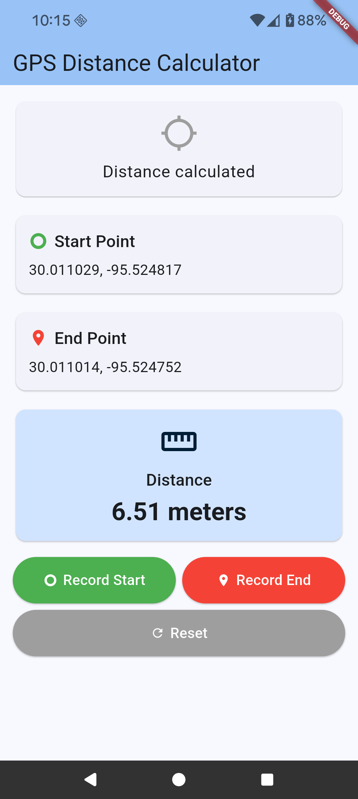

# GPS Distance Calculator

A Flutter app that uses GPS to record start and end points, calculate distances, and provide real-time distance tracking.

## Features

- 📍 **GPS Location Recording** - Record start and end points with high accuracy
- 📊 **Real-time Distance Tracking** - See live distance updates from start point
- 📏 **Distance Calculation** - Calculate final distance between two points
- 🔄 **Unit Toggle** - Switch between metric (meters/km) and imperial (feet/miles)
- 🎨 **Modern UI** - Material Design 3 interface with intuitive controls
- 📱 **Cross-platform** - Works on Android devices

## Screenshots




## Installation

### Prerequisites

- Flutter SDK (latest stable version)
- Android Studio / VS Code
- Android device or emulator

### Setup

1. **Clone the repository**
   ```bash
   git clone https://github.com/yourusername/gps-distance-calculator.git
   cd gps-distance-calculator
   ```

2. **Install dependencies**
   ```bash
   flutter pub get
   ```

3. **Run the app**
   ```bash
   flutter run
   ```

### Building for Production

**Android APK:**
```bash
flutter build apk
```

The APK will be available at: `build/app/outputs/flutter-apk/app-release.apk`

## Usage

1. **Record Start Point**
   - Tap the green "Record Start" button
   - Grant location permissions when prompted
   - Real-time tracking begins automatically

2. **Real-time Tracking**
   - Walk around to see live distance updates
   - Distance is shown in the orange card
   - Updates every 1 meter of movement

3. **Record End Point**
   - Tap the red "Record End" button
   - Real-time tracking stops automatically
   - Final distance is calculated and displayed

4. **Toggle Units**
   - Use the switch to toggle between metric and imperial units
   - All distances update automatically

5. **Reset**
   - Tap "Reset" to clear all data and start over

## Permissions

The app requires the following permissions:
- `ACCESS_FINE_LOCATION` - For precise GPS location
- `ACCESS_COARSE_LOCATION` - For approximate location
- `ACCESS_BACKGROUND_LOCATION` - For continuous tracking

## Dependencies

- `geolocator: ^13.0.1` - GPS location services
- `permission_handler: ^11.3.1` - Permission management
- `latlong2: ^0.9.0` - Coordinate utilities

## Contributing

1. Fork the repository
2. Create a feature branch (`git checkout -b feature/amazing-feature`)
3. Commit your changes (`git commit -m 'Add amazing feature'`)
4. Push to the branch (`git push origin feature/amazing-feature`)
5. Open a Pull Request

## License

This project is licensed under the MIT License - see the [LICENSE](LICENSE) file for details.

## Privacy

This app:
- ✅ Only uses location data locally on your device
- ✅ Does not send location data to any servers
- ✅ Does not store location history
- ✅ Requires explicit user permission for location access

## Future Features

- [ ] Google Maps integration with satellite view
- [ ] Route tracking with path visualization
- [ ] Distance history and statistics
- [ ] Export functionality
- [ ] iOS support

## Support

If you encounter any issues or have questions, please open an issue on GitHub.

## Acknowledgments

- Built with Flutter
- Uses Geolocator for GPS functionality
- Material Design 3 for UI components
